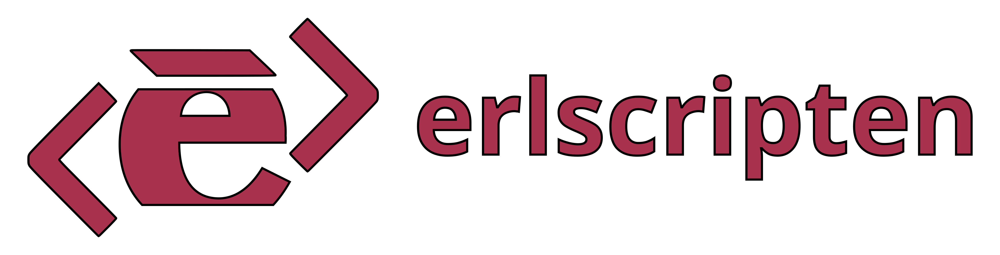

# Erlscripten – Erlang to PureScript transpiler! 

## Warning: Erlscripten is right now under heavy development - it's not ready for production use yet

## What is supported?
- Majority of erlang expression
- Arbitrary arity functions
- Pattern matching
- Records (via tuples)
- Binaries
- Lambdas
- Tail recursion
- Exceptions
- Process dictionaries
- Code server, module loading
- Imports and exports
- Compatibility utilities
- Common errors (`function_clause`, `case_clause`, `badarity`, etc.)

## What is partially supported?
- Erlang's standard library (most essential modules; `lists`, `maps`, `string`, etc.)
- Erlang builtins (growing and growing!)
- Rebar project transpilation
- ETS (missing only `duplicate_bag` implementation)

## What will be supported?
- Bitstrings
- Leaking variable scopes
- Basic erlang process emulation
- NIFs

## What won't be supported
- Hot code reloading
- Distributed erlang

<!--
## How it works?
TODO

## How to create production javascript bundles
TODO - write about rollup
-->

------------------------------

Support us at aeternity: `ak_2WESwy76bMxSxP62XDE937Dmyu8wHyV4uF8KbobMNzQxh5a1sx`

